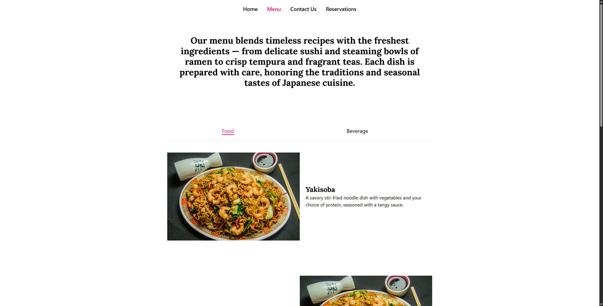

<h1 align="center" style="font-weight: bold;">Sakura Sushi 🌸</h1>

<p align="center">
 <a href="#tech">Technologies</a> • 
 <a href="#started">Getting Started</a> 
</p>

<p align="center">
    <b>A fictional completely responsive website for a traditional japanese restaurant featuring online reservations, interactive menu and a contact form</b>
</p>

<p align="center">
    Visit this Project at <a href="http://sakura-sushi-psi.vercel.app/">http://sakura-sushi-psi.vercel.app/</a>
</p>

<h2 id="layout">🎨 Layout</h2>

<p align="center">
    
    
    
    
</p>

<h2 id="technologies">💻 Technologies</h2>

- Next.js
- React
- Typescript
- Tailwind CSS

<h2 id="started">🚀 Getting started</h2>

<h3>Prerequisites</h3>

- [NodeJS](https://github.com/)
- [Git 2](https://github.com)

<h3>Cloning</h3>

```bash
git clone https://github.com/andrewsys/sakura-sushi.git
```

<h3>Starting</h3>

```bash
cd sakura-sushi
npm install
npm run dev
```
